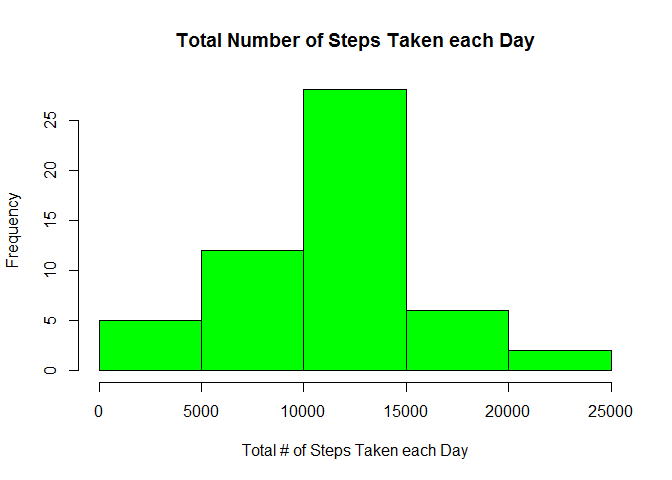
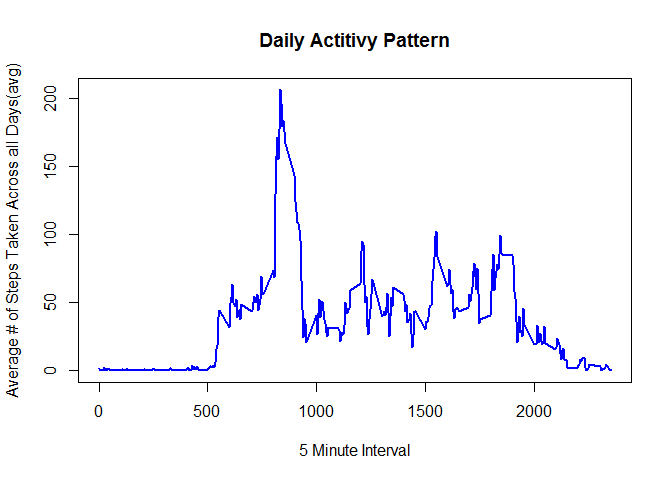
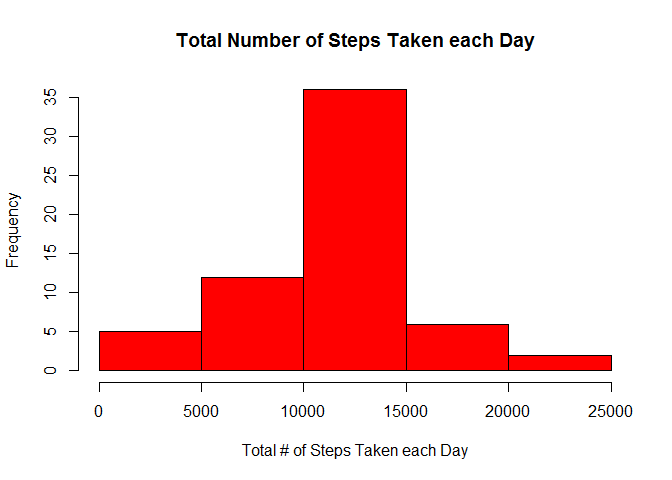
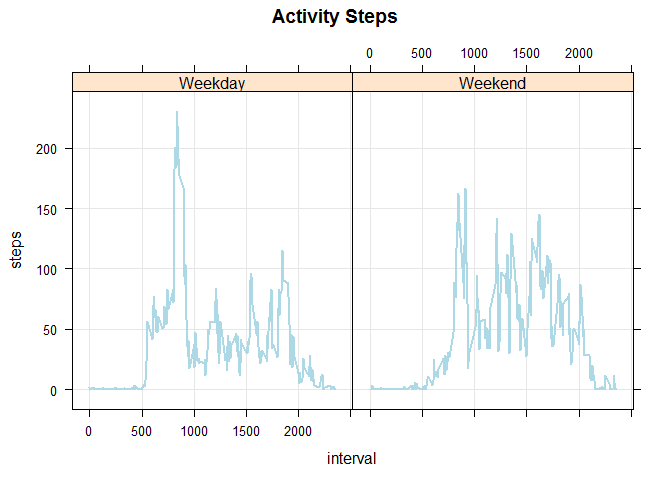

# Activity Monitoring Device Analysis

Personal movement using activity monitoring devices such as a Fitbit, Nike Fuelband, or Jawbone Up, collect a large amount of data about personal activity. The device used in this analysis collects data at 5 minute intervals throughout the day. The data consists of two months of data from an anonymous individual collected during the months of October and November, 2012 and include the number of steps taken in 5 minute intervals each day.
Data


The variables included in this dataset are:

    steps: Number of steps taking in a 5-minute interval (missing values are coded as NA)

    date: The date on which the measurement was taken in YYYY-MM-DD format

    interval: Identifier for the 5-minute interval in which measurement was taken

The dataset is stored in a comma-separated-value (CSV) file and there are a total of 17,568 observations in this dataset.


```r
repdata <- read.csv("activity.csv", header=T)
dim(repdata)
```

```
## [1] 17568     3
```

```r
head(repdata)
```

```
##   steps       date interval
## 1    NA 2012-10-01        0
## 2    NA 2012-10-01        5
## 3    NA 2012-10-01       10
## 4    NA 2012-10-01       15
## 5    NA 2012-10-01       20
## 6    NA 2012-10-01       25
```

```r
summary(repdata)
```

```
##      steps                date          interval     
##  Min.   :  0.00   2012-10-01:  288   Min.   :   0.0  
##  1st Qu.:  0.00   2012-10-02:  288   1st Qu.: 588.8  
##  Median :  0.00   2012-10-03:  288   Median :1177.5  
##  Mean   : 37.38   2012-10-04:  288   Mean   :1177.5  
##  3rd Qu.: 12.00   2012-10-05:  288   3rd Qu.:1766.2  
##  Max.   :806.00   2012-10-06:  288   Max.   :2355.0  
##  NA's   :2304     (Other)   :15840
```
###Data transformation
The following code creates and transforms the data by removing NA from the data, and creating a dataframe that consists of the sum of the steps taken for each day. 


```r
stepdata <- repdata[complete.cases(repdata),]## this removes NA from the data
stepdata <- aggregate(steps ~ date, data = stepdata, FUN=sum)## calculating the number of steps taken for each day
```
###Mean total number of steps taken per day.
The histogram below shows the total number of steps taken each day. 

```r
hist(stepdata$steps, ylab = "Frequency", xlab = "Total # of Steps Taken each Day", main = "Total Number of Steps Taken each Day", col = "green")
```

 


The mean and median  total number of steps taken per day is:

- Mean

```
## [1] 10766.19
```
- Median

```
## [1] 10765
```

###The average daily activity pattern 
The time series graph below shows the average number of steps saken across all days(avg) by 5-minute Interval.

```r
intervaldata <- repdata[complete.cases(repdata),]## this removes NA from the data
intervaldata <- aggregate(steps ~ interval, data = intervaldata, FUN=mean)##  the number of steps taken at each interval
```

 


The 5-minute interval which contains the maximum number of steps, on average across all the days is:

```r
intervaldata <- intervaldata[order(-intervaldata$step),] 
intervaldata[1,1] 
```

```
## [1] 835
```
###Imputing missing values into dataset

Since there is missing data in the dataset, I will use the mean(grouped by interval) of the number of steps taken to replace the NA's in the "steps" column of the dataset. The histogram below shows the total number of steps taken each day, using the transformed dataset. The means/medians of the dataset, before and after the replacement of the NA's are shown below, showing that the data sets are essentially equal. 

The number of NA's in the dataset before replacing the NA's with the mean.

```r
sum(is.na(repdata))##determines how many NA's are in dataset
```

```
## [1] 2304
```


```r
library(plyr)
repdata2 <- repdata
impute.mean <- function(x) replace(x, is.na(x), mean(x, na.rm = TRUE))
repdata2 <- ddply(repdata2, ~ interval, transform, steps = impute.mean(steps))
```


Histogram of the total number of steps taken each day

```r
stepdata2 <- aggregate(steps ~ date, data = repdata2, FUN=sum)## calculating the number of steps taken for each day
hist(stepdata2$steps, col = "red", ylab = "Frequency", xlab = "Total # of Steps Taken each Day", main = "Total Number of Steps Taken each Day")
```

 

Showing that the NA's have been removed from the dataset.

```r
sum(is.na(repdata2))##determines how many NA's are in dataset
```

```
## [1] 0
```


The mean and median  total number of steps taken per day is:

- Mean - the mean from before and after the removal of the NA's are  the same.

```r
mean(stepdata$steps)## this is before the NA's were removed from the data
```

```
## [1] 10766.19
```

```r
mean(stepdata2$steps)## this is after the NA's were removed from the data
```

```
## [1] 10766.19
```
- Median - the median from before and after the removal of the NA's are slightly differnt.

```r
median(stepdata$steps)## this is before the NA's were removed from the data
```

```
## [1] 10765
```

```r
median(stepdata2$steps)## this is after the NA's were removed from the data
```

```
## [1] 10766.19
```

###Are there differences in activity patterns between Weekdays and Weekends? 
I will use two time series plots, labeled Weekend and Weekday to look at the differences between activity patterns.


```r
intervaldata2 <- repdata2 ## this is the imputed mean dataset.
intervaldata2$pdate <- as.POSIXlt(intervaldata2$date,format="%Y-%m-%d")##1=mon,2,3w,4th,5f,6s,0=sun
intervaldata2[,4] <- intervaldata2[,4]$wday## numbers for converting dates to weekend/weekday
intervaldata2[,4]<-ifelse(intervaldata2[,4]<1 | intervaldata2[,4]>5,"Weekend", "Weekday")
intervaldata2 <- aggregate(steps ~ interval+pdate, intervaldata2, mean)
```


```r
library(lattice)
xyplot(steps ~ interval | pdate, data = intervaldata2, grid = T, type = "l", col.line = "lightblue", lwd = 2, main = "Activity Steps")
```

 
